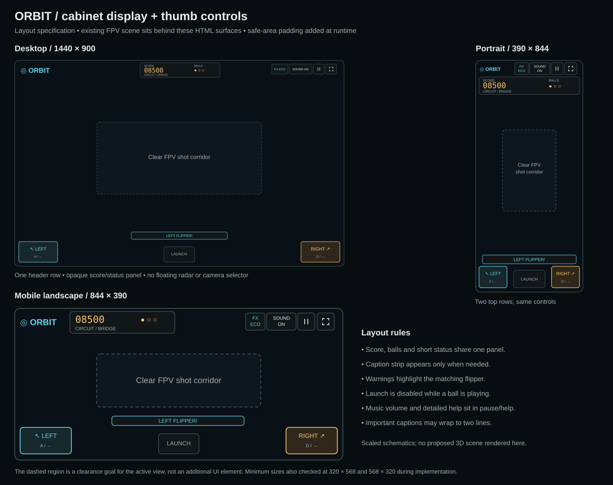

# Next implementation: cabinet, display and arcade audio

Design baseline: `main` at `51b452b91fee4fd1233dc0d69030ee46d65eafcf`, inspected 2026-10-09. This records the original implementation handoff. The runtime upgrade was implemented on 2026-10-10 (JST); see the [release record](cabinet-arcade-release.md) for the delivered scope, final values, verification and remaining device checks. Statements about proposed work below describe the original design stage.

The next release should feel like being inside a constructed arcade cabinet: readable rubber contact edges, painted housings, restrained illuminated inserts, a mechanically credible elevated circuit, one compact score/status display, and a fuller original arcade soundtrack. The selected direction comes from the [reference cabinet/UI study](reference-cabinet-ui-study.md) and the [new audio inspection](reference-audio-study.md).

## Scope and fixed gameplay contracts

Keep classic as the default table and the elevated circuit at `?circuit=1`. Preserve the existing 120 Hz free-ball simulation, CCD, launch calibration, scoring, flipper travel, guide fixes, route colliders and three-ball lifecycle. Keep `src/physics/` unchanged in this visual/audio pass. Read positions and dimensions already exported by `table.ts` and route geometry rather than constructing an independent layout.

Stable FPV remains the player camera. Preserve the existing 5% launch-triggered, three-second lost-head rotation, its caption and electronic cry, cancellation on pause/drain/restart, and reduced-motion opt-out. Do not add camera choices, a radar, or an overhead inset. The existing cabinet overview on the introduction remains an introduction, not a selectable play mode.

The reference's upper mini playfield, extra flippers, slot machine, multiball, nudge and online ranking would change gameplay. They are outside this release. No reference art, audio recording or tune enters the runtime.

## Cabinet construction

The current route already contains paired wires, cross ties and three outboard support arms, and those structures are colliders. Improve their visibility and finish; do not add a second bridge structure. The earlier study's impression of unsupported rails was a visual readability finding.

| Part | Implementation decision | Contact/clearance boundary |
| --- | --- | --- |
| Cabinet and apron | Graphite painted panels, brushed edge strips, inset seams and flush fasteners; retain the orbital theme | Place decorative construction outside the playfield or inside existing solid bounds |
| Guide rails | Readable dark contact face with a separate bright top edge; align the visible contact face with the actual rail height | Actual collider width is 0.26, centre Y 0.55, top Y 1.30; preserve all inner X/Z faces and guide endpoints |
| Bumpers | Fixed rubber contact ring and painted shell, metal skirt, small inset light lens; animate the lens/cap within the fixed shell | Physical radius 0.82, Y 0–1.04; current oversized decorative base rings should be brought into that occupied footprint |
| Flippers | Rubber perimeter, painted top and narrow metal end detail; make the visual body reflect collider thickness | Retain length 3.0, width 0.46, thickness 0.50, hinge Y 0.28 and current pivot/angles |
| Ramp and return | Distinct metal deck, translucent side panels, visible edge joints and tunnel rims | Use the existing generated route faces; apron/skirt deflectors and underpasses stay intact |
| Wire bridge | Brushed support arms, polished wire contact surfaces, visible tie joints and recessed mounting sleeves | Reuse `wireData`, `tiesData` and `supportData`; no posts or bolts protruding into the free ball path |

Deck thickness is conditional on a clearance spike. Any extrusion must sit below the current contact sheet and clear all ground approaches, aprons and underpasses. Camera clearance currently knows physical colliders, not arbitrary new decoration: detail must clear both the ball sweep and camera envelope. If that cannot be demonstrated, retain the existing faces and create the edge appearance with material/colour treatment. Do not add colliders or ball steering to rescue a cosmetic change.

## Materials, lighting and artwork

These are starting values for the material spike, not already validated final settings. Store palette/preset numbers in a small `src/render/cabinet-theme.ts`. Each model continues to own its GPU resources.

| Surface | Metalness | Roughness | Treatment |
| --- | --- | --- | --- |
| Painted graphite housing | 0.35 | 0.58 | No emission; subtle panel seams |
| Brushed steel | 0.90 | 0.32 | Environment reflection, no glow |
| Rubber contact edge | 0 | 0.85 | Dark, matte, continuous silhouette |
| Polymer bumper cap | 0.08 | 0.38 | Clearcoat 0.25; visible colour between hits |
| Ramp deck | 0.60 | 0.40 | Clearcoat 0.20; edge separation |
| Bridge wires | 0.94 | 0.28 | Highlights distinguish wires from supports |
| Small insert/lens | 0.05 | 0.32 | Local emission, approximately 0.3–0.8 idle and up to 1.8 briefly on a hit |

Start by reducing floor emission from 0.3 to about 0.08 and bumper point-light intensity from 7 idle / 43 peak to about 2 / 10. Compare exposure 0.95 with current 1.08. Keep the existing small bloom pass until the material/light comparison shows a reason to change it. The result must show coloured bumper caps, rubber edges and nearby rails during a hit, rather than a broad white glow. Tune in both High and Eco; a cue must not depend on bloom.

Keep the existing environment and directional lights. Add no point light per post, insert or rib. In Eco, disable the three bumper point lights while retaining their emissive lenses and feedback animation; `ArcadeTable.setQuality()` is called from `PinballView.setQuality()`. Keep current DPR caps: Eco 1, High 1.5. Avoid additional transmission, screen-space reflection or full-cabinet glass passes.

Under reduced motion, disable decorative light sweeps/pulsing as well as the existing spin opt-out. Retain brief state feedback and steady flipper-warning highlights; do not introduce rapid decorative strobes.

Revise the existing generated floor/backboard artwork, rather than downloading textures. Use a calmer orbital background and purposeful lane arrows, target rings and route labels. Cyan marks the left approach, amber the return/launch area; state is also communicated by text, shape or animation. Pass the table variant into artwork/model construction so classic does not advertise a nonexistent circuit. Use the existing circuit gate states for progress feedback.

Generate textures once, not per frame. The route buffer geometries currently have positions/indices/normals but no UVs: use solid material presets on those surfaces. A route texture/normal-map system is not part of this pass. Share local geometries/materials, instance repeated fasteners, merge compatible static detail, and dispose every owned geometry, material and texture once. Do not introduce a global resource cache with ambiguous disposal ownership.

## One cabinet display and a thumb control dock



Put score, remaining balls and brief game status in one opaque graphite-framed HTML display above the central FPV view. Use amber tabular numerals and a subtle decorative dot texture. Keep real text and buttons; do not paint the UI into WebGL. The top actions remain graphics quality, master sound, pause and fullscreen. Best score moves into introduction/pause/game-over surfaces.

Move `#hint` and `#toast` into the display's status row. During ordinary play an active toast temporarily occupies the hint's grid area; expiration restores the current phase/route hint. PAUSED and GAME OVER remain persistent when a dialog is open: move the single toast node to a feedback slot inside that dialog for confirmations/retry errors, then return it to the display on close. Urgent droid instructions remain in the dedicated caption strip immediately above the bottom controls and take priority over flavour/head-loss captions. The two flipper buttons remain at opposite thumb corners; launch remains centred and disabled when a ball is in play. Detailed rules and music volume live in introduction/help and pause.

| Viewport | Top display arrangement | Bottom controls |
| --- | --- | --- |
| 1440 × 900 desktop | One header row, at most 76 px high; display about 340 × 64; wordmark left, actions right | Existing generous flipper areas, at least 155 × 80; launch about 135 wide |
| 844 × 390 landscape | One compact row, at most 68 px high; display 250–280 wide; shortened wordmark | Flippers at least 125 × 64; launch about 104 × 56; caption at most two lines |
| 390 × 844 portrait | Brand/actions row, then full-width display; combined height at most 132 px | Flippers at least 96 × 76; launch about 104 wide |
| 320 × 568 / 568 × 320 minimum checks | Compact logo with accessible ORBIT name; two top rows only where width requires them | At least 92 wide flippers; short landscape dock 56 px high; launch at least 44 px high |

All dimensions are design targets before safe-area padding. Respect all four safe-area insets, `100dvh` and browser orientation changes. Keep the central shot corridor (roughly X 25–75%, Y 30–65% of the usable viewport) clear of fixed panels. At minimum widths, wrap short status and important errors instead of clipping them. Never truncate an urgent flipper instruction or the lost-head caption. Avoid reserving an empty caption band when no caption is active.

Use a 24–28 px score, at least 12 px labels/status, visible focus rings, and at least 44 × 44 px toolbar buttons. The 44 px size is a product target, stronger than WCAG 2.2's 24 px AA minimum. Proposed text colours over opaque `#111719`: main `#e8edf0` (15.34:1), secondary `#a3adb5` (7.93:1), amber `#ffc36b` (11.44:1), cyan `#63d6e8` (10.61:1). These computed token contrasts still need verification on the rendered UI. Keep the dot pattern behind text subtle; score growth beyond five digits must remain readable.

## State, focus and input

| State | Display/control behaviour | Audio behaviour |
| --- | --- | --- |
| Introduction | Existing cabinet overview, Enter table/help/table link, local best | Silent until an explicit player gesture |
| Ready / charging | Score/balls and hold/release instruction; charge bar in launch button | Calm music arrangement after sound unlock; spring charge/release effect |
| Playing | Stable FPV; launch disabled; short table/route status | Full groove, rolling and event effects; voice reacts independently |
| Circuit ascent / bridge / tunnel / return | Existing route phase labels and gate progress; return advice stays in caption strip | Rise cue, metal rattles, tunnel ambience, distinct right-return warning |
| Lost head | Existing spin/caption; no alternate view control; urgent warnings may interrupt the caption | Existing startled droid cry; music never acquires a competing voice |
| Draining | Ball-loss status, then next-ball ready state | Descending loss effect and droid cry; subdued backing until phase changes |
| Paused / hidden / blur | Frozen cabinet, PAUSED display, compact dialog; release all held inputs | Cancel voices, effects, loops and scheduled music; no background playback |
| Game over | Final score/best, Play again/help; launch unavailable | Music/rolling stop; short end cue may accompany the final droid burble |
| Muted / audio startup failure | Captions and matching flipper highlights remain; actionable retry message | No sound; clip decode failure uses immediate procedural beeps when audio itself works |

Add `src/ui/cabinet-display.ts` with a pure snapshot-to-display derivation and cached DOM updates. Read simulation phase, pause, score, balls and existing route state; this module must not calculate new scoring or route progress. Keep charge updates lightweight. Preserve existing element IDs used by the browser harnesses, including `#hud`, `#score`, `#balls`, `#hint`, `#toast`, `#droid-comms`, flippers/launch, toolbar and modal IDs. Use one `#best-score`, moved into a shared secondary surface rather than duplicated across dialogs.

Display precedence is introduction (play HUD hidden), game over, paused, ready/charging, draining, active route phase, then free play. A paused ready ball must say PAUSED; a completed game must retain its final state even if an incidental pause flag is set. Transient UI toasts cannot replace those dialog-state labels. Reset the display cache, transient message and charge state on a new game.

The score is not a live announcement on every frame. Keep the existing caption region as the single owner of spoken accessibility announcements for droid cues: polite for flavour, assertive for urgent warnings. Use the toast status for non-duplicate game/UI events. Decorative dot patterns are hidden from assistive technology.

Make the pause/game-over dialog genuinely modal: label it, make background controls inert, set initial focus to Resume or Play again, contain Tab/Shift+Tab, support Escape to resume a paused game, and restore focus on close. Browser-hidden pause should defer focus until the page is visible. Use a light scrim rather than heavy background blur so the cabinet stays recognizable. Show master sound and the music slider inside the dialog as well as the always-visible toolbar sound control; share state, not duplicate IDs.

Fix keyboard ownership as part of the UI slice. Space/Enter on a focused ordinary UI button must activate that button rather than charge the launcher. Handle game keys only in the active play surface, excluding interactive controls/dialogs. Explicit flipper/launch buttons still get their hold/release keyboard behavior. Keyup, pointerup/cancel/lost capture, blur and pause must release inputs even after focus changes. Preserve simultaneous left/right touch.

## Original sound and music overlay

The reference's inspected game code uses 24 named, event-triggered WAV effects with up to three playback instances per effect. Eight checked files range from 0.06 s for a flipper to 1.04 s for game over. No music loop or sequencer was found in that inspected code. This is source/file analysis, not a claim of having listened; [the evidence and limits are recorded separately](reference-audio-study.md).

ORBIT already has original 108 BPM music, continuous rolling/motor layers, mechanical effects, one nonverbal droid voice and priority ducking. Upgrade those existing layers. Do not run a second music loop beside the current one or imitate a recording note-for-note. The droid keeps its current lower electronic beeps, trills and screams; captions interpret them without adding spoken English.

| Layer | Next implementation | Timing/priority |
| --- | --- | --- |
| Cabinet contact effects | Original short coil/rubber/metal transients; distinguish wall, bumper, target and flipper; impact strength still follows actual events | About 50–120 ms for contact attacks; immediate, independent of voice acceptance |
| Launch and route | Original spring release, rising ramp flourish, speed-driven bridge clacks and filtered tunnel sound | Approximately 0.2–0.4 s transition accents; reuse existing route events and contact checks |
| Award and loss | Short circuit chime and contrasting drain/end phrase | Existing +750 event only; avoid a long musical fanfare under a return warning |
| Droid | Preserve lower original sprite, synth fallback, mono-distinct left/right/both/danger patterns and one active voice | Warnings priority 100; keep current event/cooldown rules and urgent interruption |
| Music | Expand the current groove into an original 16-bar arrangement: bass pulse, short soft chord pad, restrained percussion, sparse motif | Keep 108 BPM; ready uses fewer parts, playing uses the groove, draining reduces it; stop at game over |

Keep a single bounded sequencer, scheduled on the AudioContext clock with current 120 ms lookahead and maximum two steps per update. After a stall/resume, discard overdue scheduling rather than catching up. Add a pure `src/ui/music-pattern.ts` for deterministic note/part selection and small `src/ui/audio-presets.ts` for tunable gains, envelopes and timbres. `SoundDirector` derives an arrangement mode from the existing phase; retain `frame.music` compatibility for the current harness. No audio decision changes ball motion or controls.

The expanded arrangement should create space for the droid rather than continuously filling its pitch range. Pads are short and sparse, not new endless oscillators. Keep two continuous rolling/motor sources, maximum twelve effect layers, ten music layers, and one active vocal layer. Clean sources/nodes on completion and every interruption. Contact sounds remain audible on a mono phone speaker; stereo position is supplementary.

Keep master SOUND ON/OFF in the toolbar and its existing persistence. Add one Music volume slider in pause/help, 0–100%, default 60%, with a separate bounded local preference. Map 60% to the current nominal music gain 0.42; 0% silences music while preserving droid and effects. Invalid/unavailable storage falls back safely. Mute is still a master mute, and dragging this slider must not launch the ball.

Mix starting targets: ordinary vocals lower music about 12.5 dB; warnings/drain/game-over lower it about 18 dB, with roughly 15 ms attack / 120 ms recovery. Effects retain current nominal gain 0.75, lowering to 0.55 during ordinary voice and 0.30 for urgent voice. Apply ducking after the user's music level so a 0% slider stays silent. Keep the existing compressor/headroom; measured full-mix peaks should remain below 0.95. These are calibration targets, not subjective listening results. Do not globally raise the master to make the soundtrack seem richer.

Preserve gesture-based unlock, interruption recovery, decode fallback, no late replay, and the iPhone playback-session handling. The soundtrack must work in the single-file offline build without network calls. Keep reduced-motion visuals independent of audio preferences. Before accepting the slice, listen through desktop speakers/headphones and a physical iPhone, including warnings during a dense bumper/bridge section; automated nonzero signals cannot establish musical quality or speaker audibility.

## Implementation slices and spikes

| Order | Concrete work | Evidence required before advancing |
| --- | --- | --- |
| 1. Material/light spike, then cabinet slice | One bumper and nearby rail at fixed FPV poses in High/Eco; select final presets, then apply cabinet/bumper/flipper silhouettes | Lens/rubber/metal remain distinct on impact; no intrusive decorative silhouette; paired screenshots and render-cost comparison |
| 2. Clearance spike, then route/art slice | Validate optional deck edges and flush joints against ball/camera sweeps, then improve current supports, tunnel rim and variant-aware artwork | Ground approaches/underpasses and real entry/rollback/return trials pass; stable FPV and full spin show no new clipping |
| 3. HUD/input spike, then UI slice | Implement compact display at the five specified sizes, score overflow, modal focus and UI/game key ownership | No overlap/truncated urgent text; keyboard and two-finger controls pass; no radar/chooser in any state |
| 4. Audio/mix spike, then soundtrack slice | One original contact family plus a 16-bar music prototype in the existing mixer; exercise all warning patterns over dense playback | Distinct mechanical cues, bounded scheduling/resources, warnings take precedence; full-mix recordings and physical-device listening |

Each slice should be reviewable on its own. Use ordinary branches/PRs and the same table variants; do not add permanent theme flags or additional player camera modes. If a detail fails clearance or budget checks, simplify that detail before advancing.

## File ownership and validation

| Area | Expected files | Validation |
| --- | --- | --- |
| Cabinet/materials | `src/render/cabinet-theme.ts`, `table-model.ts`, `view.ts` | Fixed-pose High/Eco screenshots, contact silhouettes, resource disposal |
| Circuit/art | `src/render/route-model.ts`, `artwork.ts` | Existing generated geometry unchanged; circuit/ground-guide harnesses, camera sweep |
| Display/input | `src/ui/cabinet-display.ts`, `src/main.ts`, `src/style.css` | Meaningful state-precedence/overflow tests; focus, keyboard, simultaneous touch, pause/blur |
| Soundtrack | `src/ui/audio.ts`, `sound-director.ts`, new pattern/preset files | Deterministic arrangement/volume/duck tests, existing real Web Audio harness, bounded resources and offline build |

Run `npm test`, `npm run test:circuit`, `npm run test:guides`, `npm run test:browser`, `npm run test:audio:browser` and `npm run build` after relevant implementation slices. The present baseline has 40 unit/integration tests; the design does not claim new tests already pass for unimplemented changes. Inspect actual desktop and mobile landscape screenshots, plus portrait/minimum layout cases. Exercise both rail/guide sides, launch-lane exit, weak ramp rollback, bridge/tunnel/right return, three balls/restart, mute/start failures, paused and reduced-motion lost-head cancellation. Verify production/offline output has no debug hook and uses the original bundled audio.

### Measured render-cost baseline and budgets

The [baseline report](spikes/cabinet-upgrade-baseline.json) contains 24 held FPV samples on the current source using Chrome headless shell 155 / ANGLE SwiftShader. The browser window is 1440 × 900; the render container is resized to the stated viewport. These are draw/resource counters, not mobile emulation, a phone FPS benchmark or successful gameplay trials. High counts include the current shadow/composer passes. Texture counts depend on warm-up/quality order.

| Table | Quality | Draw calls across sampled poses | Triangles across sampled poses |
| --- | --- | --- | --- |
| Classic | Eco | 75–106 | 47,700–57,300 |
| Classic | High | 150–181 | 63,726–73,326 |
| Circuit | Eco | 65–121 | 50,040–84,438 |
| Circuit | High | 143–199 | 85,234–119,632 |

Compare candidate and baseline at each identical variant/pose/viewport/quality and warm-up order, not just global maxima. Added cost targets: Eco at most +12 calls / +10,000 triangles; High at most +20 calls / +18,000 triangles. Allow at most 16 additional unique geometries and three additional textures after comparable warm-up. Restart/quality cycles two through five should show no continuing resource growth. Audio retains the current layer/continuous-source caps above. These are proposed budgets to validate during implementation.

Reproduce the counter measurement from the repository root:

```sh
CHROME_PATH=/path/to/chrome-headless-shell node spikes/cabinet-upgrade/measure-render-cost.cjs
```

The script writes a report under `artifacts/cabinet-design/`. Use `RENDER_REPORT_PATH` to choose another output filename. Performance acceptance also needs physical-device frame-time profiling; this software-GPU sample cannot substantiate a frame-rate promise.

## Evidence and implementation guidance

- [Reference visuals and interaction](reference-cabinet-ui-study.md), with three captured screenshots.
- [Reference audio source/file inspection](reference-audio-study.md), with source hashes and sample metadata.
- [Three.js InstancedMesh](https://threejs.org/docs/pages/InstancedMesh.html) for repeated detail; update instance matrices/bounds when they change.
- [Three.js resource disposal](https://threejs.org/manual/pages/how-to-dispose-of-objects.html) for explicit geometry/material/texture ownership.
- [W3C modal dialog pattern](https://www.w3.org/WAI/ARIA/apg/patterns/dialog-modal/), [contrast minimum](https://www.w3.org/WAI/WCAG22/Understanding/contrast-minimum) and [target size minimum](https://www.w3.org/WAI/WCAG22/Understanding/target-size-minimum.html).

Design-handoff checks completed: all local Markdown links resolve, both JSON evidence files parse, the SVG parses and its rendered schematic was inspected. The reusable measurement script passes syntax checking and reproduced all 24 baseline samples with identical draw calls, triangle counts and resource counters. This change edits no runtime source. The four candidate spikes, rendered game comparisons and subjective/device audio checks above remain implementation work.

Acceptance means a visibly better cabinet in active FPV, a readable compact display on small screens, and fuller original sound that leaves urgent droid advice intelligible, while the established ball paths and camera contracts still hold.
