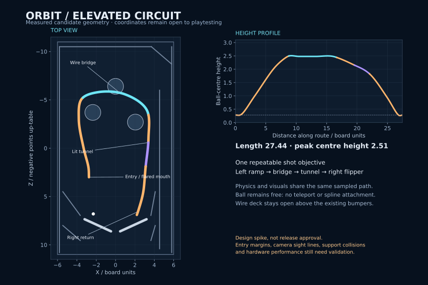

# ORBIT: the elevated circuit

Add one connected physical shot: **left ascending ramp → open wire bridge above the reactors → short illuminated tunnel → right-flipper return**. The player sees the cabinet fall away beneath the ball, passes through a brief enclosure, then comes back to the flippers with a clear opportunity for another shot.

**Implemented as an opt-in cabinet using shared path geometry and baked static wire meshes.** See [the implementation](elevated-circuit-implementation.md) and [implementation validation](elevated-circuit-validation.md). The evidence below records the original collision experiments; its geometry is retained for comparison. The playable source now includes the finished circuit at `?circuit=1`. Merging, deployment and default enablement are separate release steps.

## Player experience

The ramp mouth has an amber arrow insert and a broad, smoothly tapered lip. It rises on the left, keeping the three reactors visible underneath the upper route. The bridge uses actual supporting wires, side guides and overhead safety wires. The open deck provides the strongest sense of height in FPV. Chrome should reflect the playfield rather than obscure it with broad bloom.

On the right descent, a 2.4-unit tunnel uses cyan ribs, partly open sides and a short shaded canopy. Both portals remain legible from Table and Chase views. It leads into a descending right return with a flush exit. Complete the whole route for a provisional **750-point circuit bonus**; illuminate the next section as the player advances. Weak attempts may roll back to the playfield without losing a ball or awarding the bonus.

Keep the current controls, three-ball lifecycle and existing camera choices. Add the route outline to the radar, a higher-ball marker while on the bridge and one brief “CIRCUIT +750” notification. No new dashboard is needed. Ball jumps, multiball and a below-playfield subway belong to later designs.

## What the spikes established

Experiments use the repository's original floor, bumpers, launch lane and flippers, Rapier 0.21.0, the 120 Hz step, ball CCD and existing speed cap. Each collision variant receives 63 injected entry shots: seven speeds × three lateral offsets × three approach angles. A separate scan places incoming balls at 192 flipper setups; 160 cross the middle line and nine approach the candidate mouth. These are synthetic setups, not a player's completion rate.

Completion requires **five ordered gates in 3D**. Merely reaching the right side or falling onto the playfield does not count. A trial runs for up to 12 seconds. “Drain” and “timeout” describe the whole trial; they do not by themselves identify a collider defect.

| Collision experiment | Added colliders | Ordered completions / 63 | Flipper completions / 9 | Finding |
| --- | ---: | ---: | ---: | --- |
| Overlapping cuboid segments | 459 | 6 | 1 | Seams and stalls; reject |
| Low-wall smooth channel | 1 | 17 | 1 | Better contact, inadequate fast-shot containment |
| Bare capsule-wire bridge | 266 | 0 | 0 | Abrupt entry and weak containment; reject |
| Covered smooth channel | 1 | 20 | 1 | Useful reference, but poorer ordered-route results |
| Flared, tapered capsule-wire cage | 450 | 34 | 5 | Reachable and better contained; expensive collider count |
| **Flared, tapered baked-wire cage** | **3** | **37** | **5** | Preferred candidate: shared visible/collision tubes |

For the preferred prototype, all 18 shots at speeds 4 and 8 roll back. All 27 cases at speeds 16, 20 and 24 complete. Speed 12 produces two completions and seven rollbacks; speed 28 produces eight completions and one eventual drain. The nine consistently zero-spin flipper candidates produce five completions and four rollbacks. Completed prototype flipper traversals last roughly 2.0–3.9 seconds.

Review corrected the original scan/trial spin mismatch and a rollback classification that missed a ball reversing just beyond the bridge entrance. The remaining fast-shot defect was real: the ball descended airborne, struck the top of the resting right flipper and rebounded toward the drain. The implementation adds a monotone height profile, a lowering visible hold-down cover and an earlier flat exit before the flipper sweep. The production grid records 36 ordered completions followed by moving right-flipper returns and 27 rollbacks, with no drains or timeouts within 20 seconds. These are synthetic conditions, not a human success rate.

Three short under-bridge trajectories match the original table exactly, including a bumper score. Launch-lane exit still works within three seconds. These are targeted checks, not full cabinet coverage.

The camera replay stays within ±18° pitch, 30°/s pitch change and the existing 3.5 rad/s yaw limit, with effectively zero roll. The preferred recorded shot reaches about 15.3° pitch. Analytic clearance remains above 0.12 units. Browser previews were rendered and inspected at 1440×900 and 844×390 with no browser errors. Human comfort and a swept camera collision query remain unvalidated.

The preview adds 34 draw calls and 16,894 triangles to the same reference scene: 113 → 147 calls and 62,584 → 79,478 triangles. Software WebGL is useful for inspecting output, not measuring phone FPS. Raw timing varies with this environment; use the captured physics timings only to compare prototypes, not to forecast device performance.

The full compact evidence is [elevated-circuit-results.json](spikes/elevated-circuit-results.json). Reproduction and preview instructions are in [the spike README](../spikes/elevated-circuit/README.md).

## Geometry and collision design

Use board coordinates: X across the table, Y above its surface, Z toward the drain. Store a **ball-centre path**, section profiles and gate locations in shared table data. Generate the renderer, colliders and radar from those definitions. Simulation state must not live in Three.js meshes.

| Section | Candidate geometry | Implementation requirement |
| --- | --- | --- |
| Mouth | Centre approximately `(-2.75, 0.28, 3.0)`; 2.2-unit outside width | Smooth flare to 1.3-unit channel over 2 units; radius the wall ends and keep the floor flush |
| Rise | Left side, passing near `(-3.8, 2.05, -3.0)` | Smooth tangent and slope; weak shots must reverse naturally |
| Bridge | Nominal centre height 2.48; prototype sampled peak about 2.51 | Two support wires, four side guides, two overhead guides; open space under the deck |
| Wire transitions | 0.88-unit tapered channel; roughly 1-unit floor/wire overlap | Centre the ball before support changes; blend contact height and cap visible tube ends |
| Tunnel | Right descent, starting near Z −0.6; length 2.4 | Partly open sides, short canopy and visible exit; inner roof about 1.65 above the local floor |
| Return | Descend toward `(2.4, 0.28, 6.3)`, then `(2.2, 0.28, 6.9)` | Flush exit, no intersection with the launch divider; verify a usable right-flipper handoff |

Coordinates are a tested starting point, not a locked art contract. The experiment samples a centripetal Catmull–Rom path at approximately 0.18-unit intervals; total length is approximately 27.44 units. Production should also constrain tangent error and chord error through tight curves. Validate every generated triangle, duplicate vertex and section boundary. Avoid long, thin triangles and discontinuous winding.

The wire radius is 0.06, with support wires at lateral ±0.21. For the 0.28-radius ball, their centres sit approximately 0.267 below the ball-centre path. This keeps the resting height consistent with a solid floor 0.28 below that path. Baked tubes use eight radial sides in the experiment. Increase or adapt resolution only where contact error and close FPV views justify it.

Use fixed static trimeshes with internal-edge correction. The preferred prototype has one ascent mesh, one descent mesh and one combined wire mesh. Keep ball CCD and the fixed step. Set low route friction and an explicit **Min restitution combine rule** with zero route restitution so the ball's existing restitution does not turn a ramp seam into a spring. This setting is local to route contact.

Generate collision geometry from the same surfaces displayed to players. Clear safety panels must be visibly present wherever they contain a shot. No hidden flat deck beneath the open wire bridge, teleportation or attachment of the ball to a spline. The prototype's decorative ties, tunnel ribs and outboard supports were not included in the contact comparison; production must add their colliders where reachable, or place them outside all reachable ball volumes.

### Gravity decision

Retain the calibrated board-local vector `(0, −9.81, 3)` for this upgrade. It is equivalent to vertical gravity of magnitude 10.258 on a table rotated approximately 17.004°. A five-second physics comparison differs by at most 0.000133 units after transforming back. This is the current game's steep effective inclination, not a claim of real-cabinet calibration.

Changing to world-vertical gravity while leaving the board level would remove the current drainward acceleration and change the entire game. A later realism pass may use a visibly tilted cabinet and retuned launch/flipper forces, but those changes need their own table-wide validation. Elevation does not require that retune first.

## Route state and scoring

Track route membership separately from ball motion: `free → ascent → bridge → tunnel → return → free`. A reverse ascent exits without a bonus. A miss or departure cancels progress; re-entry requires crossing the mouth again. Reset progress on drain, restart and ball preparation.

Use swept, directional gate crossings in the local path frame, with lateral and height bounds. Place gates at the mouth, bridge entrance, bridge exit, tunnel exit and physical return exit. A crossing at playfield height underneath the bridge must not advance it. Debounce each gate and require ordered progression; a stationary ball, reverse crossing or repeated oscillation cannot farm points. Award once at the final exit, then require a fresh entry.

The spike uses five ordered proximity windows to demonstrate traversal. Production must replace those diagnostic windows with swept gate volumes and explicit hysteresis. Do not promote nearest-path lookup alone to authoritative route state: it can select the wrong level at crossings.

Do not silently reposition a stuck ball. First correct contact geometry. If cabinet ball search is later needed, specify a bounded physical kicker with a visible cue and separate tests. It must not add route progress or consume a ball.

## Camera and visibility

Keep a world-up horizon independent of ball rotation; Spin remains deliberately separate. When authoritative route state is active, guide yaw with the local path tangent and a 0.5–1.4-unit preview. Require a sustained reversal before looking backward so individual rail impacts do not jerk the view. Outside the route, retain the current velocity-based heading.

Smooth pitch toward the ascent/descent direction, capped at ±18° and 30°/s. Retain the current FPV field of view rather than adding automatic zoom. The current experiment's path-based heading is promising, but wire foreground and tight bends still need a human sight-line review. Define a reduced-motion profile with smaller pitch changes; test it rather than assuming these numeric limits are comfortable.

The normal camera offset is 0.30 above the ball centre. Use a small swept camera volume against scene colliders and retract toward the centre when the ceiling or a guard wire intrudes. Blend retraction and restoration. The spike samples an analytic cross-section down to a 0.10 offset; it is not a production collision solution. Hide the ball body in FPV as today. Keep near-plane and wide-aspect corner clearance in the sweep.

Chase also needs obstacle-aware placement near the tunnel and bridge. Table view should keep the whole cabinet in frame and make elevated and ground-level balls distinguishable through shadows and the radar. Cap tunnel opacity and avoid safety wires across the central forward sight line where possible. Replace open tube ends with smooth collars; attach supports outside the main shot lanes.

## Planned implementation sequence (now combined in this PR)

1. **Geometry and simulation PR:** shared route definition, adaptive sampling, baked mesh colliders, explicit material/contact rules, flared lip, smooth transitions and ordered gate state. Enable only in a development configuration. Reproduce successful flipper shots and resolve the recorded injected return defect.
2. **Presentation and camera PR:** finished ramp/bridge/tunnel art generated from the same geometry, physically reachable supports, camera sweep and route heading, radar and completion feedback. Merge static materials and instance repeating ribs/ties. Aim for no more than 25 additional main-pass draw calls; the current 34-call prototype needs batching.
3. **Release validation PR:** complete return-to-flipper tests, keyboard/touch/lifecycle regression, real-device playtests, performance capture and documented acceptance. Enable the route by default only after these gates pass. Keep the route configurable for a simple rollback.

Likely production boundaries are `src/physics/route-geometry.ts`, `route-state.ts`, shared route data in `table.ts`, and `src/render/route-model.ts` plus camera changes in `view.ts`. Keep dimensions shared with the radar. Do not copy the experiment wholesale: it allocates heavily, uses diagnostic nearest-sample logic and stops successful trials before a subsequent flipper shot.

## Release gates

| Area | Required evidence |
| --- | --- |
| Physics | Re-run the speed/offset/angle grid, add angular-velocity and high-Y cases, more seeds and partial-step entry positions; no out-of-cabinet ejection or persistent seam stalls |
| Weak and marginal shots | Safe natural rollback or return to the playable surface; verify the corrected rollback classification and airborne-return defect |
| Reachability | Launch-to-flipper-to-route playtests; several timing windows, not just placed incoming balls; no launch-lane regression |
| Return | Ordered traversal followed by contact with the right flipper and a controllable upward shot; no forced straight drain |
| Overpasses | Ground-level ball keeps interacting with the original bumpers; no ghost bonus, support obstruction or wrong-level route state |
| Scoring | Forward completion once; misses, rollback, oscillation, pause, drain and restart cannot retain or farm progress |
| Camera | Swept scene clearance, readable forward path at every bend and portal, no roll leakage from body rotation; human comfort in FPV and reduced-motion mode |
| Lifecycle | Current keyboard and simultaneous touch tests, pause/blur, three-ball game, restart, resize and WebGL recovery with all new resources |
| Performance | Measured frame time on a representative phone and desktop; target 60 FPS in Eco on the selected phone, fixed-step physics comfortably below its 8.33 ms budget; no accumulating resources over repeated games |
| Visual QA | Inspect Table, Chase, FPV and Spin on desktop and mobile landscape; opaque parts and collision boundaries agree; lower playfield and exits remain legible |

## Primary references

- [Rapier collider documentation](https://rapier.rs/docs/user_guides/javascript/colliders/): fixed mesh geometry, internal-edge correction and contact coefficient combination.
- [Rapier CCD documentation](https://rapier.rs/docs/user_guides/javascript/rigid_body_ccd/): continuous collision detection and its cost/limitations. Verify behavior against the installed 0.21.0 package.
- [Rapier gravity documentation](https://rapier.rs/docs/user_guides/javascript/rigid_body_gravity/): gravity belongs to the simulation coordinate frame.

The route choice, counts and camera findings above come from this repository's experiments, not those documentation pages.
