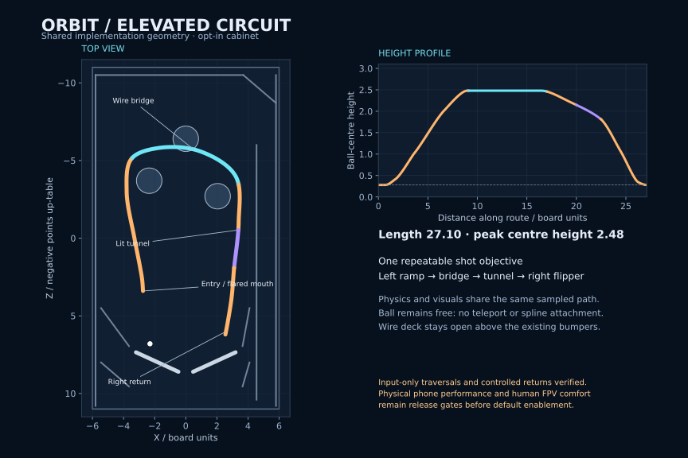

# Elevated circuit implementation

The connected left ramp, wire bridge, illuminated tunnel and right-flipper return are implemented as an optional cabinet. Open `?circuit=1`, or choose **Try elevated circuit** on the opening screen. Classic remains the default. This PR updates the earlier design/spikes and contains the playable source; it does not merge or deploy itself.

## Contact and geometry

`table.ts` defines a ball-centre route. `route-geometry.ts` uses a centripetal horizontal curve and monotone Hermite height interpolation, with adaptive sampling limited by chord length, curvature and midpoint error. Bridge, tunnel and transition boundaries are validated before generating meshes. This prevents the prototype's height overshoot at the crest and landing. The finished path is 27.104 units long, sampled into 273 frames, with a nominal crest height of 2.48. Moving balls may rise above that path through real contact; the path is not a constraint on the body.

The ascent and descent meshes overlap the baked wire cage at their transitions. Two supporting wires, four side guides and two overhead guards leave the bridge deck open. Shared typed mesh data feeds Rapier and Three.js. Four fixed meshes cover the channel, wire cage/ties and outboard supports. Route contact uses low friction, zero restitution with the Min combine rule, and internal-edge correction. The original ball CCD, 120 Hz step, gravity, launch force, flippers and speed cap remain calibrated as before.

The low ascent and return heels have ground-height skirts with diagonal rear deflectors, merged into the same collision and deck batches. They prevent a ground ball from entering the closing underside gap while higher underpasses stay open. [The stall fix and reproduction](low-ramp-stall-fix.md) document this follow-up and its 96 ground-approach checks.

The fast-shot spike failed because the descending ball struck the top of the right flipper while airborne. A visible clear hold-down cover now lowers smoothly toward a flat landing; the channel ends at `(2.55, 0.28, 6.2)`, before the flipper sweep. A physics query checks the entire rest-to-raised-and-back flipper volume against the new structures. Weak shots reverse and roll back naturally. No force steers the ball along the route, and no ball is repositioned to recover a miss.

## Rules and presentation

`route-state.ts` requires five forward swept crossings with local lateral and height bounds: mouth, bridge entry, bridge exit, tunnel exit and return exit. Misses, mouth rollback, discontinuous movement, drain and ball preparation clear progress. The final gate awards 750 points once, followed by a cooldown; a new attempt must enter through the mouth. Ground-level underpasses cannot advance elevated gates. Starting a new game also clears the completion count.

`route-model.ts` batches the collision surfaces, chrome cage, supports, clear safety panels, tunnel canopy/ribs, trim and progress lamps. Decorative trim sits outside the guarded free-ball volume. The opening-screen link exposes the cabinet, the radar draws its footprint and rings elevated balls, and the existing hint/toast and pooled score effects announce the circuit and right return. No new control is required.

`route-camera.ts` keeps yaw and pitch independent of the ball quaternion. Active route state previews 0.5–1.4 units ahead; a sustained reversal changes the look direction. Pitch is capped at 18° and 30°/s, or 8° and 15°/s with reduced motion. Yaw retains its 3.5 rad/s bound. FPV and Chase sweep their near-plane envelope against the actual Rapier scene, excluding the ball. Retraction is immediate; restoration is smoothed but checked again each frame. Extreme aspect ratios reduce the near distance to keep the corners within that envelope. Pause freezes the controller; restart and camera switching clear relevant state. Spin remains a deliberate body-rotation view.

## Verification and rollout

[Validation](elevated-circuit-validation.md) separates the 63 synthetic entry cases, 18 spin/partial-step variants, input-only launch trials and playable browser checks. The corrected historical prototype comparison remains in [the design](elevated-circuit-design.md); its spin setup and rollback classification are now consistent. Browser-launch failure also closes its server cleanly.

The implemented circuit is ready for code review and optional playtesting. Enabling it by default still requires representative phone/desktop frame-time measurements and human FPV comfort checks. This work does not make a hardware FPS claim.
