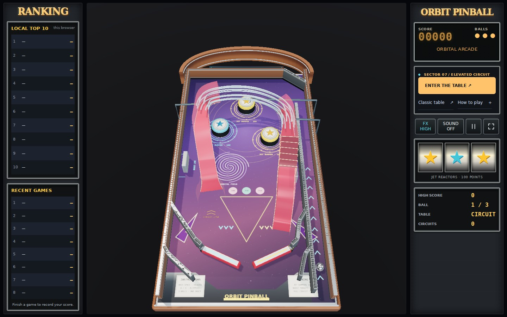

# Reference cabinet and desktop console

The [subsequent course correction](reference-course-release.md) replaces the original playable layout with measured reference coordinates. The contact dimensions and default-table statements below describe this earlier visual release.

The [Hyperspace Pinball reference](https://pinball-fbd1a.firebaseapp.com/) has a distinctive physical cabinet and three-column desktop interface. ORBIT now recreates that visual composition with generated artwork and geometry, while keeping its first-person game and calibrated table contacts.

| Reference feature | ORBIT implementation |
| --- | --- |
| Curved wooden enclosure with chrome bands | Extruded walnut rear arch, chrome bands, existing wooden side rails and metal trim |
| Purple illustrated playfield | Star field, orbital rings, spiral field, gold score markings and printed slingshot shapes |
| Yellow/cyan star bumpers | Sculpted caps, shared warm/cool star atlas, tapered collars, black rubber barrels and chrome skirts |
| Red translucent ramps | Red decks and rose polycarbonate side panels on the existing elevated circuit |
| Printed apron instructions | Brushed metal artwork with cream rule cards and gold ORBIT PINBALL lettering |
| Framed rankings on the left | Real local top ten and eight recent completed games; empty rows remain empty |
| Amber display and framed panels on the right | Score/balls/status, three collision-driven star lamps, current ball, table, completed circuits, high score and real controls/scoring |

The overview is an opening presentation. Playing uses stabilized FPV, with the existing brief lost-head reaction and reduced-motion support. There is no camera selector or radar inset. The three star windows are bumper indicators; they do not add slot-machine rules. Rankings use optional local storage and retain an existing personal best when available. Corrupt history is ignored, and recorded history is bounded to fifty games.

The desktop console activates at a viewport of at least 1024×600. Controls remain at least 44 pixels across and stay inside the central play area. Smaller viewports use the compact interface; resizing before play moves the same Start button between layouts. Pause still makes the entire background inert and keeps keyboard focus inside the dialog.

The startup layout is reconciled before Start is enabled, including when a breakpoint changes while physics or shaders initialize. The design browser check gates real WASM startup to verify both directions. Routine screenshots are written only under ignored `artifacts/reference-design/`; the documentation image is an explicit release snapshot.

## Rendering and contacts

The new cap radius is 0.79 and its resting top is 0.985, inside the existing bumper radius of 0.82 and height of 1.04. Scoring hits depress the cap by 0.10 and illuminate its matching console window for 350 ms. Lighting sits near the skirt so it does not bleach the printed star. The decorative rear arch sits outside the playable contact faces. Ramp paths, rails, flippers, 120 Hz physics and ball CCD retain their existing dimensions and rules.

The cabinet continues to use static GPU batches, cached shadows, shared textures, bounded collision effects, shader warm-up and adaptive render resolution. Removing the animated arena leaves a simpler dark backdrop. Detailed bumper caps remain independent moving objects; the scene continues to update their world transforms.

## Verification

Verification results, runtime source hashes and matched draw counters are recorded in [the validation report](validation/reference-cabinet.json). All of the following passed:

- 59 unit tests, TypeScript/Vite build and standalone HTML generation; the production debug hook is absent.
- Design checks at 1440×900, 1024×600 and 844×390, including real bumper-to-console feedback, completed-score persistence and resize/start behavior. Desktop and mobile landscape screenshots were inspected.
- Seventeen gameplay browser checks, including real keyboard launch, simultaneous touch flippers, pause/blur, three-ball lifecycle, context recovery and reduced motion. Cabinet/input checks passed in five viewport layouts, including nine-digit scores and modal keyboard focus.
- Real Web Audio checks in desktop classic and mobile circuit views: decoded nonverbal droid cues, collision/route reactions, rolling/music, warning priority, mute/reload, interruption recovery, resource bounds and the three-ball sound lifecycle.
- Chromium 155 and WebKit 26.5 renderer checks: moving world transforms, cached/invalidated shadows, HDR fallback, stable textures across quality switches, idle buffers and adaptive resolution with unchanged HTML controls.
- Circuit entry sweeps (63 cases plus 18 spin/partial-step variants), 96 ground approaches and two input-only launch/return trials. Both-side guide sweeps cleared all 1,431 valid classic and 1,179 valid circuit arrivals; invalid overlapping seeds and closed heels are excluded.

| Held FPV pose | Previous calls, High / Eco | New calls, High / Eco |
| --- | --- | --- |
| Launch lane | 91 / 90 | 79 / 78 |
| Ground | 71 / 70 | 59 / 58 |
| Wire bridge | 56 / 55 | 49 / 48 |
| Tunnel | 53 / 52 | 49 / 48 |

Render counters compare the same four held FPV poses and actual 1440×900 buffers with the previous desktop release. These are workload checks on ANGLE SwiftShader, not measured frame rates on a physical PC. Human FPV comfort and the final music/voice listening balance still require physical-device playtesting.
