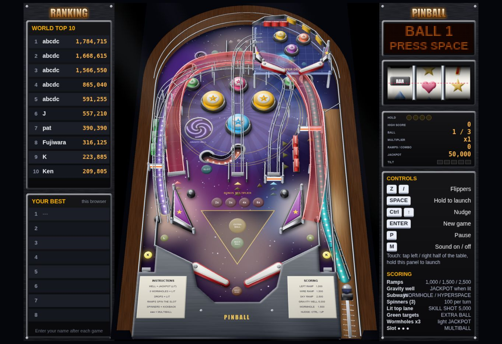
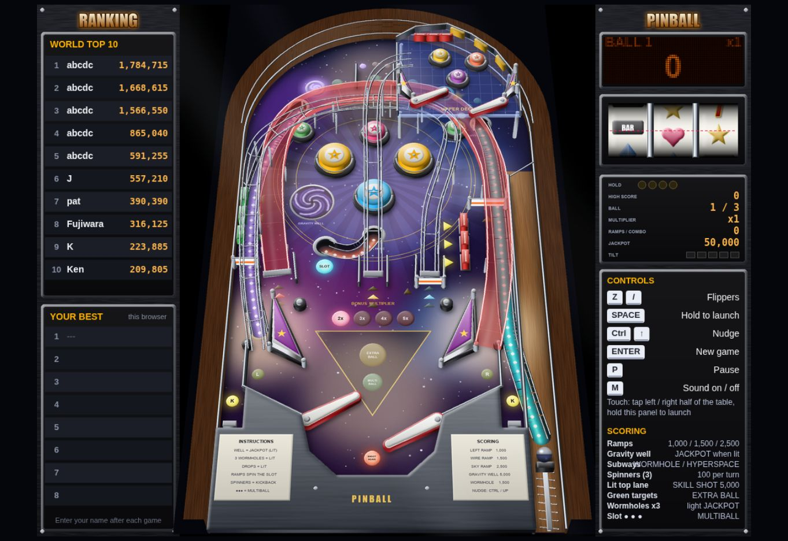

# Cabinet and UI study: Hyperspace Pinball

Reference: https://pinball-fbd1a.firebaseapp.com/ — inspected on 2026-10-09 through its running browser UI. This study concerns visible design and interaction, not its source code or physics implementation.

Follow-up: [the implementation handoff](cabinet-ui-audio-upgrade.md) specifies cabinet materials, contact boundaries, display layout, original audio, work order and measurable budgets. A separate [audio inspection](reference-audio-study.md) records the reference's event sounds and the limits of that source/file analysis.

The useful direction for ORBIT is a denser, more believable pinball cabinet viewed from inside, with a compact cabinet-style score display. The reference's overhead view and wide sidebars do not fit the requested FPV experience.

## Captured flow

1. **Ready to launch — clear.** The cabinet occupies the centre, rankings sit on the left, and the dot-matrix display, game state and instructions sit on the right. The display explicitly asks for Space. A brown cabinet surround, metal trim, curved back wall and launch lane give the playfield a convincing enclosure.

   

2. **Active play and left flipper input — responsive.** Space launches the ball and Z visibly raises the left flippers. Raised wire paths, a translucent ramp, an upper mini playfield and different bumper heights make the cabinet read as multiple physical layers. Lit inserts connect targets and routes to the playfield artwork.

   

3. **Pause — clear and unobtrusive.** P changes the dot-matrix display to PAUSED while retaining the cabinet context. The pause state uses an existing information surface rather than covering the playfield with a new panel.

   

## What to transfer into ORBIT

| Reference detail | FPV adaptation | Implementation boundary |
| --- | --- | --- |
| Solid cabinet surround and metal trim | Distinct apron, rubber/metal contact edges and cabinet panels that look convincing at ball-eye height | Match existing collider positions and camera clearance |
| Several visible mechanical layers | More convincing ramp decks, paired wire rails, rail posts, brackets and underpasses | First refine existing route meshes; new upper-playfield mechanics need a separate physics spike |
| Large bumpers and lit inserts | Rubber rings, caps and illuminated lane arrows with recognizable silhouettes | Preserve the calibrated shots and ball clearance |
| Coherent floor artwork | Route colours and directional inserts integrated into the table surface | Maintain contrast at the low FPV angle, including Eco quality |
| Dot-matrix display and separate game-state panel | One compact score/lives/status area; pause and short events can use the same visual language | Keep play controls as accessible HTML buttons and retain readable captions |
| Instructions outside the active table | Short introduction/help panel and persistent left/right flipper affordances | Avoid large rules panels during play |

The rankings and slot panel are optional future features. They should not consume the FPV play area. No radar, overhead inset, camera chooser or secondary table view should return, including during the rare lost-head rotation.

## Concrete direction for the next pass

**Cabinet.** ORBIT's current FPV screenshots show broad glowing bumper surfaces and long, visually unsupported rails. Give the bumpers separate cap, rubber ring and metal skirt materials, with restrained bloom so their shape stays visible. Give wire bridges paired rails, cross ties, support posts and mounting brackets aligned with the existing route. Add deck thickness, tunnel rims and joints that can be recognized from ball height. Cabinet edges and guide faces should show distinct metal, rubber and panel surfaces. These details should make the existing mechanics readable without changing their collision boundaries.

**Playfield.** Use illuminated inserts and arrows to connect existing shot entrances, targets and returns. Integrate them into coherent floor artwork instead of scattering decorative lights. Evaluate their silhouettes from FPV: details that look clear overhead can disappear behind a bumper or ramp at ball height. Keep the next collision edge readable in both High and Eco quality.

**UI.** Consolidate score, balls and brief game status into one compact arcade display with amber numerals and a restrained dot-matrix texture. Keep its text as accessible HTML rather than baking it into the 3D scene. Keep nonverbal reaction captions and urgent left/right warnings legible over the table, with warnings taking precedence. Retain two thumb-accessible flipper buttons and the launch control; move detailed rules into help/pause surfaces. Preserve usable focus, keyboard controls and simultaneous touch when simplifying the layout. The reference's PAUSED display is a useful model for keeping the cabinet visible while communicating state.

## Proposed visual work order

1. Refine the existing cabinet, bumper, guide and route materials and silhouettes. Preserve collider geometry, launch calibration and the established return path.
2. Add convincing joints, posts and deck edges to the current bridge/tunnel. Check these from stable FPV and during the three-second spin, rather than judging only an overhead render.
3. Consolidate score, lives and short status into a compact arcade display. Put detailed rules and local scores in introduction/pause surfaces. Keep simultaneous touch controls and keyboard equivalents.
4. Inspect desktop, mobile landscape and portrait screenshots in High/Eco quality. Verify no insert or display obscures the next shot. Run the existing launch, flipper-guide, circuit, pause and reduced-motion checks.
5. Treat an actual upper mini playfield, extra flippers or new routes as later gameplay work, with free-ball physics and clearance tests before adding them to the cabinet.

This PR implements the already-requested radar removal and voice refinement. The larger cabinet and score-display redesign above is a documented proposal, not a claim that those meshes or layouts have already shipped.

## Accessibility and evidence limits

The reference exposes the game as one image in its accessibility tree. The visible keyboard guide is useful, but semantic controls, focus, screen-reader usability and mobile layout were not verified. ORBIT should retain its actual buttons and status live regions. The reference was inspected on desktop; no inference is made about its source code, collision accuracy, physical-device performance or audio synthesis. Screenshots are credited to the reference app and retained as study evidence; no artwork or game assets were imported into ORBIT's runtime.
