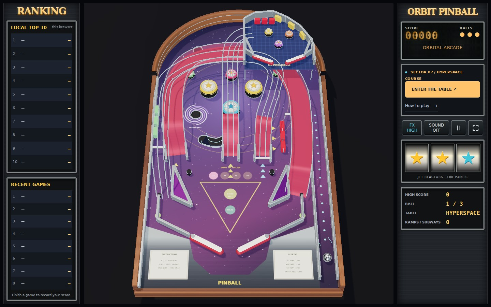

# Reference course correction

The previous cabinet release restyled ORBIT's original table. It did not reproduce the reference course. The default game now uses the measured coordinates of [Hyperspace Pinball](https://pinball-fbd1a.firebaseapp.com/) for its playable layout, shared by rendering and physics. Old links with `?circuit=1` also select this course.

| Course feature | Implemented layout and behavior |
| --- | --- |
| Rounded enclosure | Semicircular playable rear arch, curved launch-lane exit and one-way launch gate |
| Six ground bumpers | Two yellow jets side by side, cyan jet below, pink small bumper above and two green side bumpers |
| Left red ramp | Original 480-point path and height profile; right inlane exit; 1,000 points |
| Wire ramp | Original 450-point path and height profile; left inlane exit; 1,500 points |
| Sky ramp | Original 198-point path and height profile; raised mini playfield exit; 2,500 points |
| Upper deck | Height 58 reference units, three small bumpers, two target banks and paired mini flippers driven by A/D |
| Ground mechanics | Main flipper pair, triangular slings, target/drop banks, posts and three moving spinners at their measured positions |
| Below-board features | COMET, HYPERSPACE and BLACK HOLE paths, kidney-shaped trough and scoop, gravity well and paired portals |

The reference's opening projection is reconstructed from its public homography. Nine bumper base positions are checked against that projection at three viewport sizes, with a maximum error below 0.05 screen pixels. Gameplay remains stabilized FPV, with the existing brief lost-head reaction and reduced-motion behavior. Rankings remain local, and the three console stars show real jet-bumper impacts.

## Motion and audio

Free balls, contacts and all four flippers use Rapier's fixed 120 Hz simulation and CCD. Ramps and subways use a constrained path rider, matching the reference's approach; ramp speed responds to downhill gravity and friction. Weak shots reverse and roll out without a completion award. Completed paths release the dynamic ball at the measured exit; the sky ramp releases it onto the actual raised deck. Targets disable their own drop collider and reset after three simulation seconds. Pause freezes rider progress and timers. Restart restores flipper angles and releases any held/guided ball.

The original nonverbal droid voice, music and cabinet mixer remain. New paths produce ascent, bridge and completion reactions, subways produce tunnel reactions, and flipper forecasts account for the upper deck. Spinner clicks no longer announce a completed ramp. Browser audio probes observe actual Web Audio output, accepted voice cues, warnings on both levels, and sustained music/rolling sound.

Ramp entry and bridge reactions are queued by fixed-step phase events, so a slow render frame cannot skip them. Disabled drop targets no longer suppress advice for a clear return. The complete score-texture cache includes the two 50-point bumpers. Idle opening frames reuse their shadows, hiding the intro ball invalidates its shadow once, and spinner decay reaches zero so its shadow can settle. Spinner supports remain stationary scene objects; both endpoints of all three spinners are checked against their measured world coordinates before static batching.

## Provenance

Coordinate facts are snapshotted in `src/physics/reference-course-data.json`; gameplay and rendering code were written for this project. No reference images, audio recordings or JavaScript modules are shipped. The publicly served files were inspected on 2026-10-10:

| Public resource | SHA-256 |
| --- | --- |
| [index.html](https://pinball-fbd1a.firebaseapp.com/index.html) | `866647c09011f191907c42c699ca5e4973fa143be33da23f0c9cfab2d074c95d` |
| [game.js](https://pinball-fbd1a.firebaseapp.com/game.js) | `d6892599aee2fefb1887fc9aab9a5fda36f03c86de93058264a81c68e7968f27` |
| [assets.js](https://pinball-fbd1a.firebaseapp.com/assets.js) | `10715488e0a0ab588d7478e0ced405c9162ed82fe0677f764e3cf977d1fceb22` |

Materials, illustrations, visual effects, FPV presentation and game tuning are original. Casino/slot rules, online ranking services, exact artwork and the reference's complete scoring rules are outside this course-layout correction. It is not a pixel-identical copy of the whole reference game.

## Verification

The [validation record](validation/reference-course.json) separates measured layout, controlled physics shots and input-only traces. Reproduce the course checks with `npm test`, `npm run test:course`, `npm run test:course:browser` and `npm run test:course:audio`.

Strong controlled entrance shots complete all three ramps, and weak shots roll back. All three subways pass below the board and return to their specified destinations. Both sides of both playfields clear all 639 valid guide arrivals; 459 overlapping seeds are excluded. Input-only launch/flipper traces complete the wire and sky ramps and enter the left ramp with a weak shot; these automated traces do not establish that every human shot is easy to make.

The cabinet retains static GPU batches, cached shadows, bounded effects, shader warm-up and adaptive resolution. Software browser checks verify rendering and resource behavior; they do not measure physical PC frame rates. Human FPV comfort, left-ramp shot timing and the final listening balance still need physical-device playtesting.
